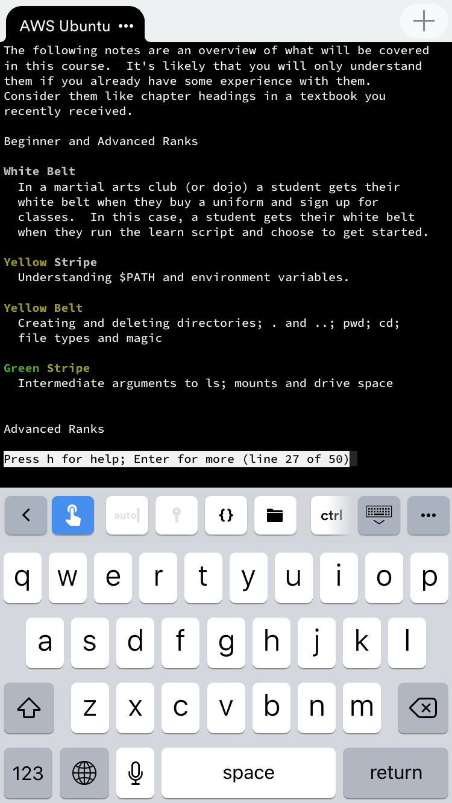
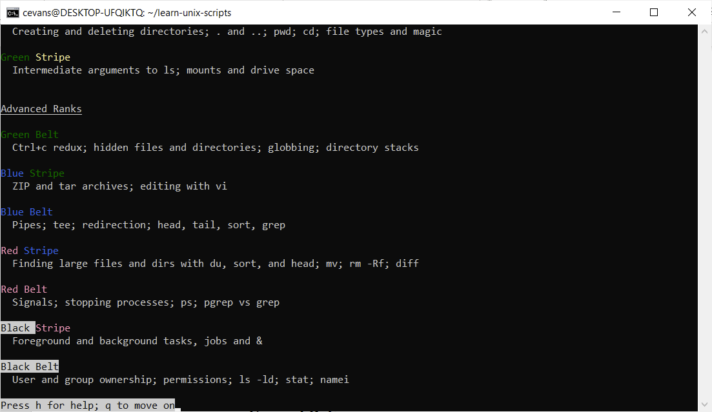
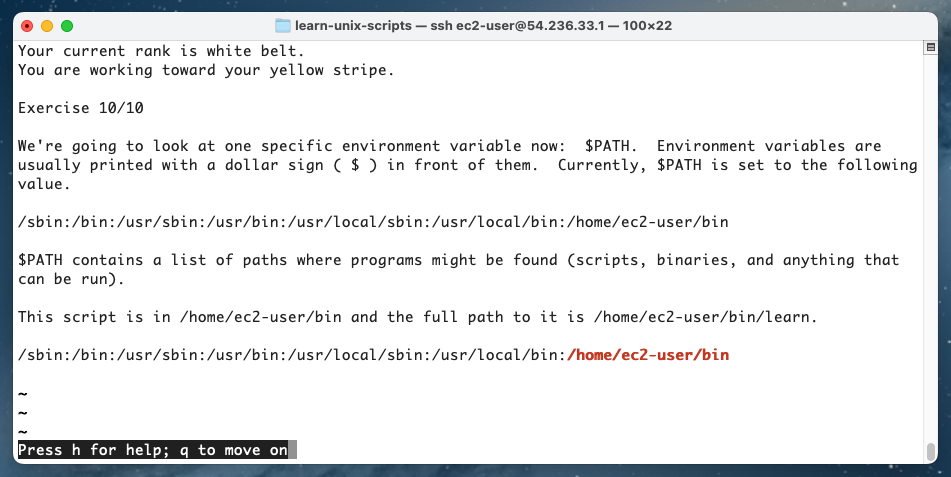

This project runs on a variety of operating systems and configurations.

The scripts can also handle small terminal sizes (smaller than 80 columns).  The very first screen the student is presented with tries to cover all the bases.  The first screenshot is from Cygwin running on Windows 10.  Newer versions of Cygwin require ncurses and tput.  It's not particularly pretty output.  In fact, it's a dancing bear.  

> The marvel is not that the bear dances well, but that the bear dances at all.

&mdash; Russian proverb

The second screenshot is what the user sees after pressing "q".  It's from Terminus on an iPhone (with the Pro theme) connected to an Ubuntu server running in AWS.

The third screenshot shows an overview of the material for the advanced belts.  It's from WSL 2 in Windows 10 running Ubuntu 22.04 LTS.

The next screenshot shows an SSH connection from Mac OS X to a FreeBSD instance in AWS.  FreeBSD doesn't have full colour support as it has a different version of tput.  The scripts can also run directly on Mac OS X or on Mac OS X through Docker.

